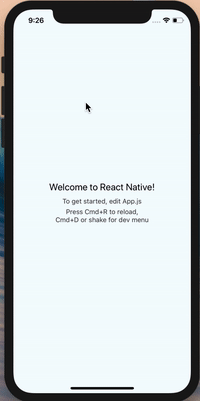
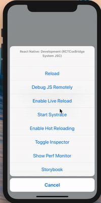

## Poorman's storybook
*This is an example of how you can create your own simplified storybook and having access to it through React Native's dev menu. I also show how you can do the same with storybook* 

[Medium post about this]()

### With simplified storybook

### With storybook

